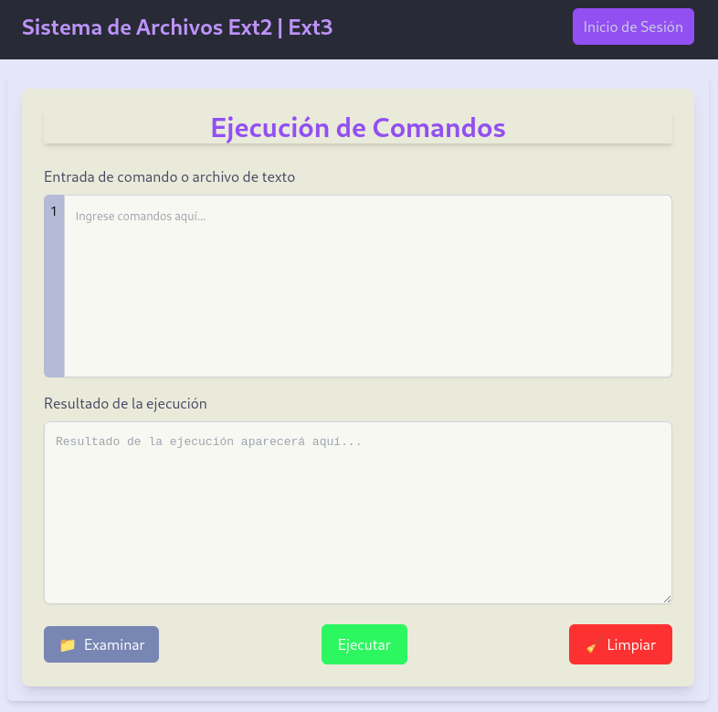

# MIA_2S_P1_202100106

## Descripcion del Proyecto

Este proyecto ofrece una interfaz de usuario creada con React para gestionar y ejecutar comandos de un sistema de archivos ext2 y ext3 de manera simulada. El usuario puede escribir sus comandos directamente en el área de texto o cargar un archivo, y la aplicación se encarga de enviar dicha información a un servidor para su análisis. El resultado de la ejecución se muestra en tiempo real, acompañado de un contador de líneas, indicadores de carga y notificaciones de éxito, error o información. Además, se incluyen opciones para reiniciar el campo de entrada y cargar nuevos archivos de forma fácil, brindando una experiencia de usuario fluida e intuitiva.

## Características principales

- **Ejecución de comandos**: Ingresa comandos manualmente o a través de un archivo para procesarlos en el servidor.
- **Retroalimentación en tiempo real**: Muestra los resultados en pantalla y notifica al usuario con mensajes de éxito, error o información.
- **Contador de líneas**: Facilita la edición de los comandos al mostrar la numeración de cada línea.
- **Limpieza rápida**: Botón dedicado para resetear el texto de entrada y los resultados de salida.
- **Carga de archivos**: Posibilidad de subir un archivo de texto para ejecutar varios comandos a la vez.
- **Interfaces intuitivas**: Uso de React y TailwindCSS para lograr un diseño responsivo y agradable.

<p align="center">
  
</p>

## Tecnologías y dependencias

<p align="center">
  
  
  
  
</p>

Este proyecto se divide en dos partes: **Frontend** (React + Vite + TailwindCSS) y **Backend** (Go + Fiber).

### Frontend

- **React** / **React DOM**: Biblioteca para construir la interfaz de usuario.
- **Vite**: Herramienta de desarrollo y empaquetado rápido.  
- **TailwindCSS**: Framework CSS para un diseño responsivo con clases utilitarias.  
- **TypeScript**: Aporta tipado estático y mayor robustez en el desarrollo.  

#### Instalacion React & Vite

```bash
#Utiliar el empaquetador de preferencia en este caso npm
npm install -D vite
#Crear el proyecto
npm create vite@latest
#Entrar a la carpeta creada e instalar las dependencias
npm install
#Iniciar el servidor
npm run dev
```

#### Tailwindcss

```bash
npm install -D tailwindcss postcss autoprefixer
npx tailwindcss init -p
```

Se va a crear un archivo tailwind.config.js en la raíz del proyecto. En este archivo se pueden configurar los estilos de tailwindcss. Se debe agregar el siguiente código:

```bash
#Archivo tailwind.config.js
content: [
    "./index.html",
    "./src/**/*.{js,ts,jsx,tsx}",
  ],
```

Por último se debe importar tailwindcss en el archivo index.css:

```bash
/* Archivo index.css */
@tailwind base;
@tailwind components;
@tailwind utilities;
```

### Backend

- **Go (Golang)**: Lenguaje de programación de alto rendimiento para la lógica del lado del servidor.  
- **Fiber**: Framework web rápido y minimalista para construir APIs.  

#### Instalacion Fiber

```bash
#Iniciar el modulo de Go en el proyecto
go mod init backend
#Se instala el framework de Go (Fiber)
go get -u github.com/gofiber/fiber/v2
#Iniciar el servidor de desarrollo con el siguiente comando
go run main.go
```

### Ejecucion del Proyecto

- Luego de iniciar los entornos tanto de frontend como backend,abra <http://localhost:3000> para el servidor (Esto util para probar endpoints o ver el backend sin la interfaz grafica) y <http://localhost:5173> para ver la aplicación en el navegador.

## Comandos usados en el Sistema Ext2 y Ext3

La aplicación cuenta con un conjunto de comandos para gestionar el sistema de archivos ext2 de manera simulada. A continuación, se describen brevemente los principales:

- **mkdisk**: Crea un nuevo disco en la ruta especificada.
    Ejemplo:

    ```bash
    # Crea un disco de 100 Mb con First fit en el path que desee
    mkdisk -size=100 -unit=M -fit=FF -path="/home/user/disco.mia"
    ```

- **rmdisk**: Elimina un disco existente.
    Ejemplo:

    ```bash
    # Elimina el disco en la ruta especificada
    rmdisk -path="/home/user/disco.mia"
    ```

- **fdisk**: Maneja las particiones del disco.
    Ejemplo:

    ```bash
    # Crea una partición primaria de 50 Mb en el disco especificado
    fdisk -size=50 -unit=M -path="/home/user/disco.mia" -type=P -name="Part1"
    ```

- **mount**: Monta una partición.
    Ejemplo:

    ```bash
    # Monta la partición especificada en el disco
    mount -path="/home/user/disco.mia" -name="Part1"
    ```

- **mkfs**: Formatea una partición.
    Ejemplo:

    ```bash
    # Formatea la partición con el id especificado
    mkfs -id=vd1 -type=full
    ```

- **rep**: Genera reportes.
    Ejemplo:

    ```bash
    # Genera un reporte del MBR del disco especificado
    rep -id=vd1 -path="/home/user/disco.mia" -name=mbr
    ```

- **login**: Inicia sesión en el sistema.
    Ejemplo:

    ```bash
    # Inicia sesión con el usuario y contraseña especificados
    login -user=admin -pass=1234 -id=vd1
    ```

- **logout**: Cierra la sesión actual.
    Ejemplo:

    ```bash
    # Cierra la sesión actual
    logout
    ```

- **mkgrp**: Crea un nuevo grupo.
    Ejemplo:

    ```bash
    # Crea un nuevo grupo con el nombre especificado
    mkgrp -name=users
    ```

- **rmgrp**: Elimina un grupo existente.
    Ejemplo:

    ```bash
    # Elimina el grupo con el nombre especificado
    rmgrp -name=users
    ```

- **mkusr**: Crea un nuevo usuario.
    Ejemplo:

    ```bash
    # Crea un nuevo usuario con el nombre, contraseña y grupo especificados
    mkusr -user=user1 -pass=user -grp=users
    ```

- **rmusr**: Elimina un usuario existente.
    Ejemplo:

    ```bash
    # Elimina el usuario con el nombre especificado
    rmusr -user=user1
    ```

- **chgrp**: Cambia el grupo de un usuario.
    Ejemplo:

    ```bash
    # Cambia el grupo del usuario especificado
    chgrp -user=user1 -grp=users
    ```

- **mkfile**: Crea un nuevo archivo.
    Ejemplo:

    ```bash
    # Crea un nuevo archivo en la ruta especificada
    mkfile -path="/home/user/archivo.txt" -size=100
    ```

- **mkdir**: Crea un nuevo directorio.
    Ejemplo:

    ```bash
    # Crea un nuevo directorio en la ruta especificada
    mkdir -path="/home/user/nuevo_directorio"
    ```

- **cat**: Muestra el contenido de un archivo.
    Ejemplo:

    ```bash
    # Muestra el contenido del archivo especificado
    cat -path="/home/user/archivo.txt"
    ```

- **help**: Muestra el mensaje de ayuda con la lista de comandos disponibles.
    Ejemplo:

    ```bash
    # Muestra el mensaje de ayuda
    help
    ```

- **clear**: Limpia la terminal.
    Ejemplo:

    ```bash
    # Limpia la terminal
    clear
    ```

- **exit**: Sale del programa.
    Ejemplo:

    ```bash
    # Sale del programa
    exit
    ```

---
